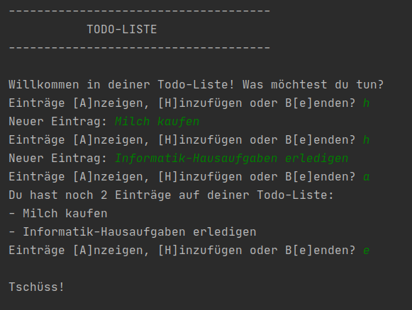
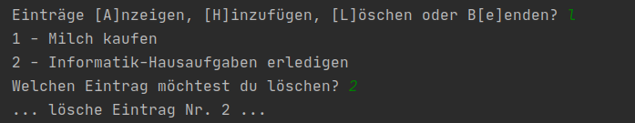

# Projekt 4: Todo-Liste

Versucht, das abgebildete Programm selbst zu bauen. Der **weiße** Text ist die Ausgabe des Programms. Der **grüne** Text wird vom Benutzer eingegeben.

Schreibe dein Programm in die Datei `program.py`.

ACHTUNG: Im Moment wird die Liste noch nicht gespeichert und muss bei jedem Neustart wieder eingegeben werden. Diese fehlende *Persistenz* beheben wir in der nächsten Stunde. 

## Das könnte dir helfen:

**Listen**

    namen = ['Jule', 'Nils', 'Lena']
    zweiter_namen = namen[1]
    namen.append('Benny')
    # namen -> ['Jule', 'Nils', 'Lena', 'Benny']
    
Es gibt noch viele weitere Methoden wie `.append()` für den Datentyp "Liste". Du findest sie in der [Python-Dokumentation](https://docs.python.org/3/tutorial/datastructures.html).

**Länge**
`len()` gibt die Länge eines Objekts als Ganzzahl zurück:

    lehrer = ['DRI', 'MAT']
    len(lehrer)
    # -> 2

## Bonusaufgabe:

Versuche auch die Option zu implementieren, Beiträge wieder zu löschen:

Eine geeignete Methode findest du in der [Python-Dokumentation](https://docs.python.org/3/tutorial/datastructures.html) zu Listen.
